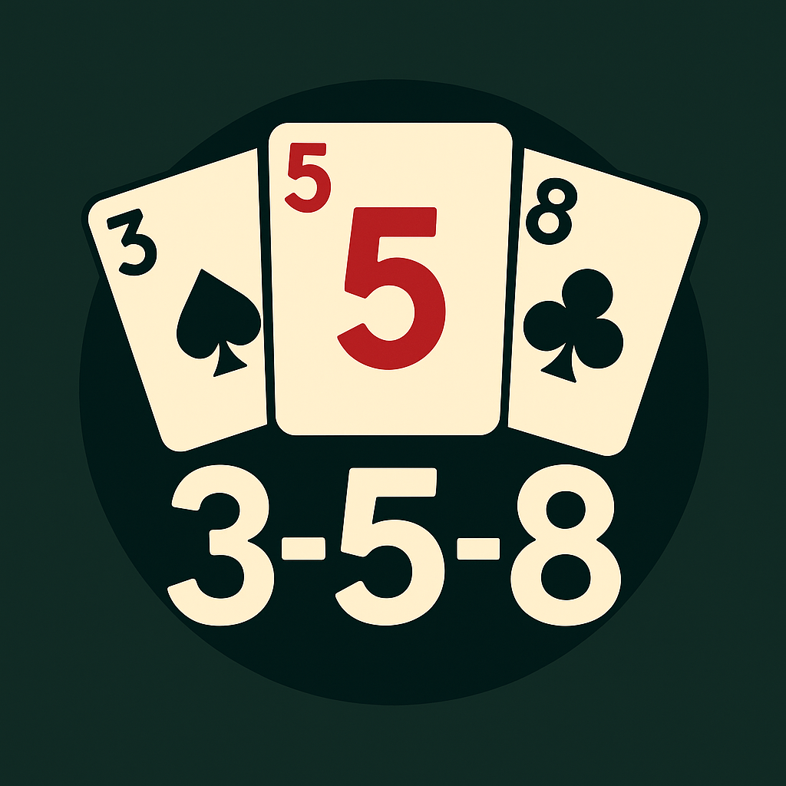
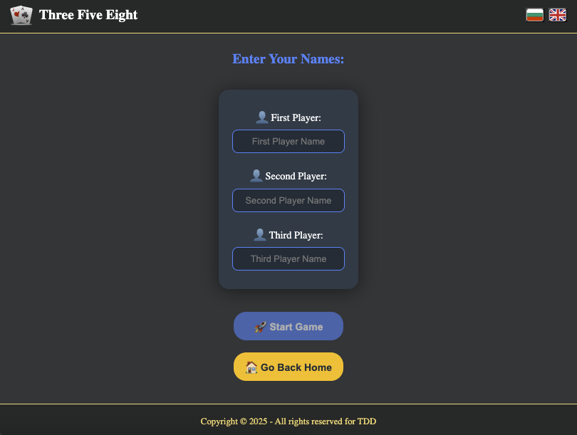
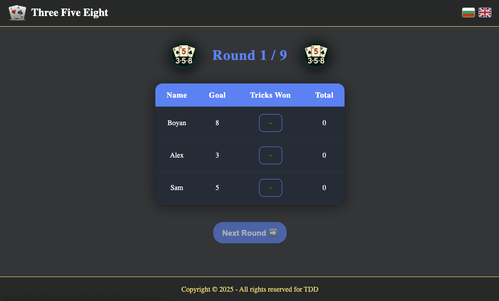

<p align="center">
  
</p>

# Three Five Eight (358) Card Game

<p align="center">
  <a href="https://three-five-eight.vercel.app/"></a>
  <a href="LICENSE"></a>
  
</p>

---

## 🎲 About the Game

Three Five Eight (358) is a trick-taking card game for three players. The objective is to win a specific number of tricks each round, with the target changing for each player.

---

## ✨ Features

- 🃏 Play the classic 358 card game in your browser
- 📱 Responsive, modern UI
- 🌐 Multi-language support (English & Bulgarian)
- 🧮 Game logic and scoring implemented in TypeScript
- 🧩 Modular Angular architecture
- 🎨 custom SCSS styles

---

## 🖼️ Screenshots





---

## 🛠️ Tech Stack

- **Framework:** Angular
- **Languages:** TypeScript, HTML, SCSS
- **State Management:** Angular Services
- **Internationalization:** JSON-based i18n
- **Build Tooling:** Angular CLI

---

## 🚀 Getting Started

1. **Clone the repository:**

   ```bash
   git clone https://github.com/your-username/three-five-eight.git
   cd three-five-eight
   ```

2. **Install dependencies:**

   ```bash
   npm install
   ```

3. **Run the app locally:**
   ```bash
   ng serve
   ```
   The app will be available at [http://localhost:4200](http://localhost:4200).

---

## 📁 Project Structure

```
src/
  app/
    components/      # Reusable UI components (header, footer, etc.)
    helpers/         # Game logic helpers
    layout/          # Layout components
    models/          # TypeScript models (Player, RuleSection, etc.)
    pages/           # Main pages (game board, home, player setup, rules, not found)
    services/        # Angular services (game logic, state)
    styles/          # SCSS partials for styling
  assets/
    i18n/            # Translation files (en.json, bg.json)
    images/          # Game images and icons
  index.html
  main.ts
  styles.scss
```

---

## 🌍 Internationalization

The app supports multiple languages. To add or edit translations, update the JSON files in `src/assets/i18n/`.

---

## 📝 License

This project is licensed under the [MIT License](LICENSE).

---

## 🙏 Acknowledgements

- [Angular](https://angular.io/)
- [Vercel](https://vercel.com/) for hosting
- Card game rules: [Wikipedia - Three Five Eight](https://en.wikipedia.org/wiki/Three-Five-Eight)
